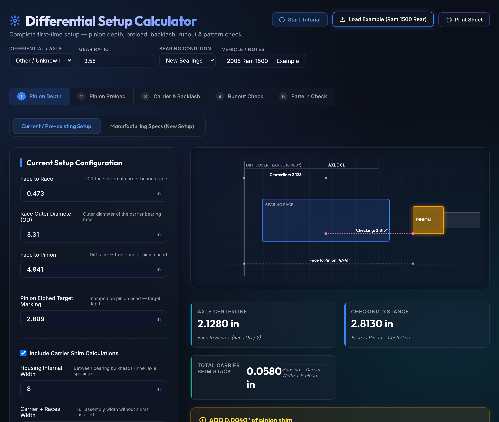
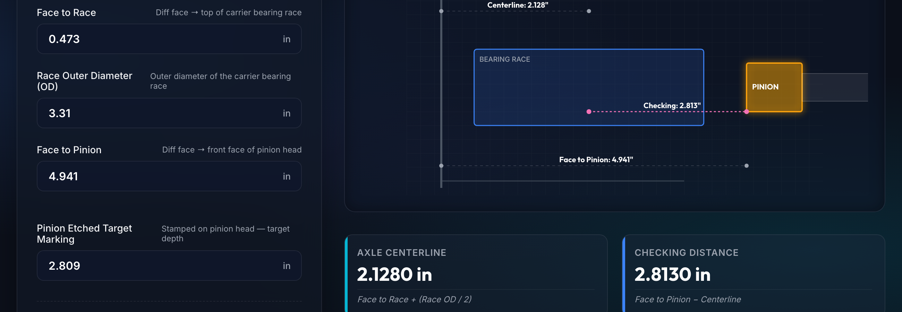
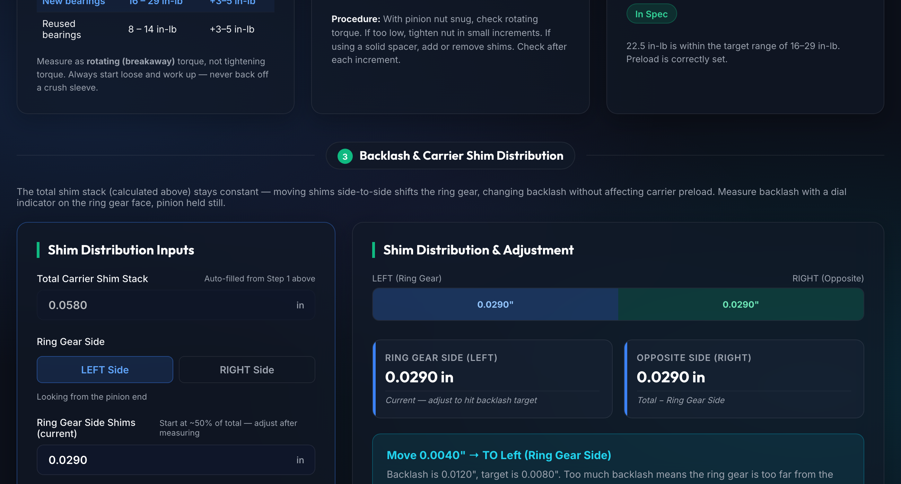
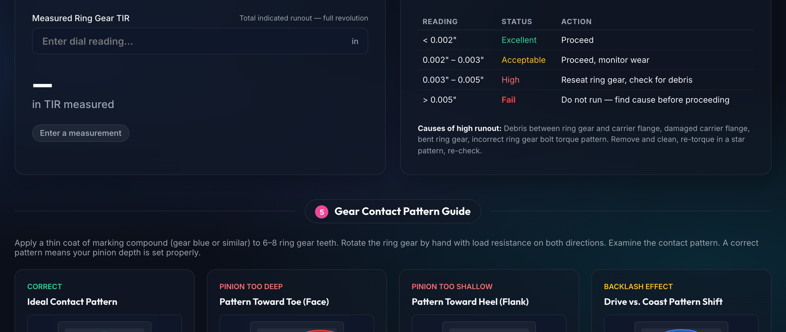

# Differential Setup Calculator

**A professional browser-based calculator for completing a full first-time differential rebuild setup — pinion depth, rotating preload, carrier shim distribution, ring gear runout, and contact pattern analysis.**

---

## Preview



| Step 2 — Pinion Preload | Step 3 — Backlash Solver | Step 5 — Pattern Guide |
|---|---|---|
|  |  |  |

---

## Features

- **Double Shimming Solvers**:
  - **Mode 1 — Pre-existing / Current Setup**: Calculates checking distance and shimming directions based on housing measurements and physical check distances.
  - **Mode 2 — Manufacturing Numbers**: Solves shim thickness using target manufacturer dimensions and pinion head thickness specs.
- **Interactive SVG Visualizer**: Renders a live, scaled diagram showing the differential housing cover flange, bearing race, axle centerline, and pinion depth that updates instantly with your input numbers.
- **Axle Database**: Built-in rotating torque specs and backlash ranges for:
  - **Ford** 8.8", 9"
  - **Dana** 30, 35, 44, 60
  - **GM** 7.5", 8.5", 8.6", 12-bolt
  - **Chrysler** 8.25", 9.25"
  - **Toyota** 8"
- **Automatic Pinion Preload Evaluator**: Input rotating torque measurements (in-lb) and get real-time warnings if preload is too low, in-spec, slightly high, or too high (which requires replacing the crush sleeve).
- **Backlash Shim Redistribution Solver**: Computes the exact side-to-side carrier shim transfer (in thousandths of an inch) needed to hit your target backlash without altering bearing preload.
- **Ring Gear Runout Checker**: Diagnoses dial indicator Total Indicated Runout (TIR) values and recommends when to reseat or inspect flange surfaces.
- **Marking Compound Pattern Guide**: Built-in visual cards indicating ideal contact patterns, deep patterns, shallow patterns, and backlash effects, with recommended shim corrections.
- **Printable Garage Sheet**: Responsive CSS styling formatted for print, letting you print a clean build sheet directly from the browser to keep in the workshop.
- **Interactive Setup Tutorial**: Includes an auto-launching step-by-step walkthrough tour that guides the user through the input fields, SVG diagram, shimming logic, and calibration tools.

---

## Platform

**Cross-platform (HTML5 / Javascript)**. Works on any browser. A macOS double-click launcher (`launch.command` and `setup.command`) is included for convenience.

---

## Install & How to Run

### Option 1 — In the Browser (Recommended)
1. Double-click **`launch.command`** (macOS) or open **`index.html`** directly in any modern browser.
2. If macOS blocks the `.command` launcher, right-click it, select **Open**, and confirm.
3. **Interactive Setup Walkthrough**: When first launched, the app automatically starts an interactive step-by-step tutorial tour guiding you through the setup sequence. You can re-trigger this tour at any time by clicking the **Start Tutorial** button in the header.

### Option 2 — In the Console (Python CLI)
The calculator includes a fully featured command-line version in Python.
1. Open terminal in the directory.
2. Run the script:
   ```bash
   python3 differential_calculator.py
   ```
3. Run the unit test suite to verify calculation logic:
   ```bash
   python3 -m unittest test_calculator.py
   ```

---

## How It Works: The Math & Formulas

The calculator isolates individual variables to model the physical location of the ring gear and pinion teeth in the housing.

### 1. Axle Centerline
The axle centerline (CL) serves as the datum point.
$$\text{Axle Centerline} = \text{Face to Race} + \left(\frac{\text{Race OD}}{2}\right)$$
*This locates the exact center of the carrier assembly relative to the differential cover face.*

### 2. Pinion Checking Distance
- **Pre-existing (Mode 1)**: Renders the physical distance from the front face of the pinion head to the axle centerline:
  $$\text{Checking Distance} = \text{Face to Pinion} - \text{Axle Centerline}$$
- **Manufacturing (Mode 2)**: Solves for target face location and current mounting distance:
  $$\text{Target Pinion Face} = \text{Mfg Checking Distance} + \text{Axle Centerline}$$
  $$\text{Current Mounting Distance} = \text{Mfg Checking Distance} + \text{Pinion Head Thickness}$$

### 3. Shim Adjustment Rule
$$\text{Shim Adjustment} = \text{Checking Distance} - \text{Pinion Target Etched Marking}$$
- **Positive Difference ($>0$)**: Pinion is too far from centerline (too shallow). **ADD** shim to push it deeper.
- **Negative Difference ($<0$)**: Pinion is too close to centerline (too deep). **REMOVE** shim to pull it back.

### 4. Carrier Shim Stack & Preload
$$\text{Total Carrier Shim Stack} = (\text{Housing Internal Width} - \text{Carrier Width}) + \text{Desired Carrier Preload}$$
*Preload is typically set to $+0.008\text{ in}$ to create bearing crush.*

### 5. Backlash Shim Distribution
To shift the ring gear closer to or further from the pinion without altering the total carrier preload, shims are moved side-to-side:
- **Too much backlash**: Move shim equal to the error **TO the Ring Gear side** (from the opposite side).
- **Too little backlash**: Move shim equal to the error **AWAY from the Ring Gear side** (to the opposite side).

---

## File Structure

| File | Type | Description |
|---|---|---|
| [index.html](index.html) | HTML5 / CSS3 / JS | Core GUI dashboard, visual SVG layout, and interactive calculator. |
| [differential_calculator.py](differential_calculator.py) | Python 3 | Reference console-based command-line calculator. |
| [test_calculator.py](test_calculator.py) | Python Unit Test | Math and logic tests verifying formulas against known vehicle specs. |
| [setup.command](setup.command) | Bash Shell | Executable permission fixer and setup utility for macOS. |
| [launch.command](launch.command) | Bash Shell | Shortcut to launch the calculator directly in your default browser. |
| [OVERVIEW.md](OVERVIEW.md) | Markdown | General documentation and step-by-step setup overview. |

---

## Built by Shawn Bryant
